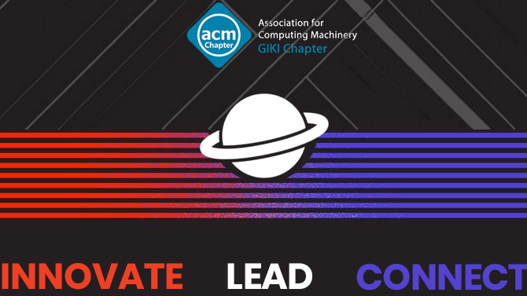

 

## About Us 

ACM GIKI is the official student chapter of the Association for Computing Machinery (ACM) at Ghulam Ishaq Khan Institute. Our mission is to promote excellence in the field of computing through innovative projects, skill-building sessions, and collaborative activities. We bring together a community of tech enthusiasts eager to learn, build, and create solutions that make a real impact.

## Featured Projects 🔍

Explore our latest projects (available soon):
- **AI Influencer** 🤖  
  Using AI to generate engaging content inspired by influential personalities.
- **Automated Certificate Distribution** 📜  
  Streamlining certificate generation and distribution for events and workshops.
- **Chat Bot** 💬  
  An adaptive bot designed to enhance user interactions in various contexts.
- **Society Election System** 🗳️  
  A secure platform for fair and transparent society elections.

> *Note:* These projects are currently under development and will be made public shortly. Once live, we invite everyone to explore and contribute, regardless of ACM GIKI membership status!

 

## Connect & Contribute 🤝

- 🏫 For all contributors: Our repositories are open to anyone interested in contributing to meaningful tech solutions. We encourage collaboration and welcome both society members and the broader tech community.
- 🔄 Contribution Guidelines: Please review and follow our generic [Contribution Guidelines](https://docs.github.com/en/communities/setting-up-your-project-for-healthy-contributions/setting-guidelines-for-repository-contributors) to ensure consistency and quality in all project contributions.

 

## Let's Code Together! 🌐

Our Profile is a hub for tech enthusiasts to come together, share knowledge, and create real-world solutions. We believe in empowering our members and contributors to explore, innovate, and make a positive impact on the field of computing.

 

## Connect with Us 📲

---
